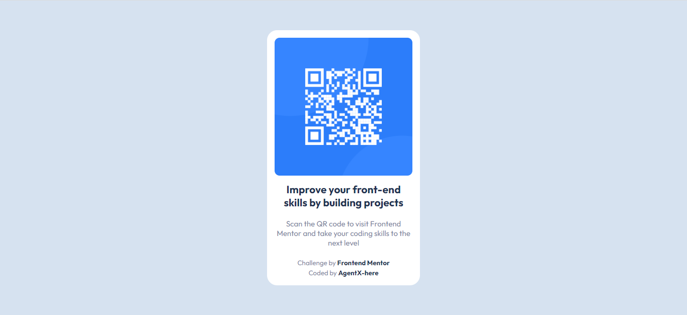

# Frontend Mentor - QR code component solution

This is a solution to the [QR code component challenge on Frontend Mentor](https://www.frontendmentor.io/challenges/qr-code-component-iux_sIO_H).

## Table of contents

- [Overview](#overview)
  - [Screenshot](#screenshot)
- [My process](#my-process)
  - [Built with](#built-with)
  - [What I learned](#what-i-learned)
  - [Useful resources](#useful-resources)
- [Author](#author)

## Overview

### Screenshot



## My process

### Built with

- HTML (Hyperlink Markup Language)
- CSS (for styles)

### What I learned

This project was an application of what I learned before ... So I didn't learn too much. I just tested my abilities.

By the way, I am so proud I learned the "@media screen and (max-width: 0px)" method :D

```css
@media only screen and (max-width: 800px) {
  .container {
    width: 40%;
  }
}

@media only screen and (max-width: 450px) {
  .container {
    width: 80%;
  }
}
```

### Useful resources

Umm ... I think I did everything by myself :D
... Oh, except for a question in the discord server which wasn't EVEN RESPONDED. So I won't count it

## Author

- Website - [Add your name here](https://www.your-site.com)
- Frontend Mentor - [@AgentX-here](https://www.frontendmentor.io/profile/AgentX-here)
- Twitter - [@yourusername](https://www.twitter.com/yourusername)